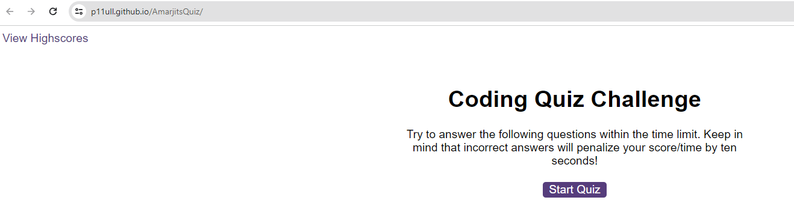

# AmarjitsQuiz
Web API showcasing timed qiuz using JavaScript
Provide a short description explaining the what, why, and how of your project. Use the following questions as a guide:

- What was your motivation?
I wanted to build a timed coding quiz with multiple-choice questions. This app will run in the browser, and will feature dynamically updated HTML and CSS powered by JavaScript code that I have written. It will have a clean, polished, and responsive user interface. 

I wanted to create code for analysing the financial records of a company.

- Why did you build this project? (Note: the answer is not "Because it was a homework assignment.")
 I wanted to showcase my Javascript skills 
- What problem does it solve?
  * Taking a quiz
  * press the start button and timer starts and a question is presented
  * when the question is answered another question is presented
  * if the question is answered incorrectly time is subtracted from the clock
  * if the question is answered correctly another question is presented
  * when all questions are answered or the timer reaches 0
  * the game is over
  * when the game is over
  * then I can save my initials and score

- What did you learn?
I took the starter code and refactored it to meet a certain set of standards or implement a new technology. 

## Table of Contents (Optional)

If your README is long, add a table of contents to make it easy for users to find what they need.

- [Installation](#installation)
- [Usage](#usage)
- [Credits](#credits)
- [License](#license)

## Installation

What are the steps required to install your project? Provide a step-by-step description of how to get the development environment running.
Upload index.html, highscores.html and all files in the assets folder to the deployed webserver. Rightclick with mouse, select inspect and go to console.

The deployed (https://p11ull.github.io/AmarjitsQuiz/) website linked above was deployed using GitHub Pages.

## Usage

Once deployed the application can be viewed in a traditional desktop web browser. It is not yet optimized for other devices.

## Credits

Collaborators on this project included instructional staff.

I followed tutorials
https://coding-boot-camp.github.io/full-stack/github/professional-readme-guide.
https://www.w3schools.com/js/DEFAULT.asp
https://www.youtube.com/watch?v=cVbBJV9WZyY
https://developer.mozilla.org/en-US/docs/Web/JavaScript/Reference/Global_Objects/JSON/stringify

## License

MIT License

## Badges

[Badge] https://img.shields.io/badge/just%20the%20message-8A2BE2

## Features

Semantic HTML elements can be found throughout the source code

HTML elements follow a logical structure independent of styling and positioning

Image and icon elements contain accessible alt attributes

Heading attributes fall in sequential order

Title elements contain a concise, descriptive title

## How to Contribute

If you created an application or package and would like other developers to contribute it, you can include guidelines for how to do so. The [Contributor Covenant](https://www.contributor-covenant.org/) is an industry standard, but you can always write your own if you'd prefer.

## Tests

Tests to ensure the code works were conducted on google chrome.
open the webpage. click refresh.
